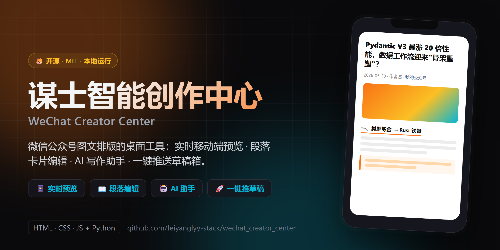

<p align="center">
  
</p>

<p align="center"><b>中文</b> · <a href="README.en.md">English</a></p>

# 🔮 谋士智能创作中心 · WeChat Creator Center

一个面向**微信公众号深度原创文章**的桌面级协同写作套件，集 **「移动端排版实时预览」**、**「段落卡片化智能编辑」**、**「AI 写作助手协同」** 与 **「一键 API 直推草稿箱」** 于一体。

专为技术深度科普文做了排版优化（紧凑行距、首行顶格、H2 通栏下划线、引用框、微信小字等），尽可能还原微信移动端的真实渲染效果。

> 纯前端（HTML/CSS/JS）+ Python 本地服务，零云端、零账号、所有数据都留在你自己机器上。

---

## ✨ 功能亮点

| 功能 | 说明 |
| --- | --- |
| 📱 **移动端排版实时预览** | 微信原生字号(16px)、行高(1.75)、字间距、浅色/夜间双模式、H2 通栏分割线、引用框，尽量与公众号后台渲染对齐。可实时编辑标题、作者、日期、公众号名。 |
| 📖 **模块化段落编辑** | 自动把文章反解析为段落 / 标题 / 引用 / 图片 / 视频 / 表格卡片，`🔼`/`🔽` 一键挪动、`➕` 下方插入、`❌` 删除。 |
| 🤖 **AI 写作助手** | 可配置任意兼容 OpenAI 接口的大模型（默认 DeepSeek）。未填 API Key 时由本地「🦊 AI 小助手」离线模拟；填入后直连真实大模型润色标题、扩写导读、提炼结论。 |
| 💾 **本地 Headless CMS** | 后台监听 `127.0.0.1:8080`，把编辑结果一键写回本地 `output/pushed_article.html`。 |
| 🚀 **一键推送草稿箱** | `push_to_draft.py` 读取本地文章，自动上传配图到微信 CDN 并直推到你的公众号草稿箱。 |

---

## 🚀 快速开始

提供两种使用方式，按需选择：

### 方案 A：下载独立 EXE（开箱即用，推荐零基础用户）

1. 前往本仓库 **[Releases](../../releases)** 页面，下载最新的 `wechat_creator_center.exe`。
2. 双击运行，会弹出一个独立桌面窗口，后台自动跑起本地 CMS 服务，绿色免安装。
3. *注：未购买代码签名证书，首次运行若被 Windows SmartScreen 拦截，点「更多信息」→「仍要运行」即可。*

### 方案 B：用 Python 脚本启动（走默认浏览器，无误报）

1. 安装 [Python 3.8+](https://www.python.org/downloads/)，安装时勾选 **Add Python to PATH**。
2. 双击仓库根目录的 **`双击启动创作中心.bat`**（或在终端运行 `python local_server.py`）。
3. 脚本会在 `127.0.0.1:8080` 起一个本地服务并自动用默认浏览器打开创作中心。
4. **浏览器模式仅依赖 Python 标准库，无需 pip 安装任何包，不会被杀软误报。**

---

## ⚙️ 配置微信公众号凭证（仅推送草稿功能需要）

只想排版 + 复制富文本到公众号后台手动粘贴的话，**无需任何配置**，跳过本节即可。

如需用 `push_to_draft.py` 一键推送草稿：

1. 在创作中心右侧「🔑 微信公众号 API 凭证配置」里填入 `AppID` 和 `AppSecret`，点保存——会自动写入 `output/wechat.env`。
   - 也可手动把 [`wechat.env.example`](wechat.env.example) 复制为 `output/wechat.env` 并填写。
   - 凭证获取：微信公众平台 → 设置与开发 → 基本配置 → 开发者ID / 开发者密码。
2. 微信要求把服务器出口 IP 加入「IP 白名单」（基本配置页），否则会拒绝发放 access_token。

> ⚠️ **`output/wechat.env` 含敏感密钥，已被 `.gitignore` 忽略，切勿提交或外传。**

---

## 📋 一键推送草稿用法

```bash
pip install requests          # 推送功能需要 requests
# 1) 在创作中心「段落深度编辑」里点击「保存至本地 Headless CMS」，导出 output/pushed_article.html
# 2) 打开 push_to_draft.py，修改顶部 CONFIG 区的标题/作者/摘要/封面图
python push_to_draft.py
```

脚本会自动发现正文里引用的本地图片、上传到微信 CDN 换成可用链接，再把图文推送到草稿箱。随后到公众号后台「草稿箱」检查、群发即可。

---

## 📂 目录结构

```text
wechat_creator_center/
├── index.html                  # 前端主结构（自带一篇示例文章作为演示）
├── style.css                   # 玻璃拟态 UI + 微信原生夜间模式样式
├── script.js                   # 反向解析、段落卡片、AI 联动、本地持久化逻辑
├── local_server.py             # 浏览器模式本地服务（纯标准库，方案 B）
├── app_launcher.py             # 独立 EXE 的 pywebview 窗口 + CMS 服务（方案 A）
├── push_to_draft.py            # 一键推送公众号草稿箱（通用版）
├── package_desktop_app.py      # PyInstaller 打包脚本
├── wechat_creator_center.spec  # PyInstaller 配置
├── 双击启动创作中心.bat          # 方案 B 一键启动器
├── wechat.env.example          # 公众号凭证模板
├── requirements.txt            # 可选依赖（打包 / 推送用）
├── data_orchestration_cover.png / pydantic_rust_core.png / woodland_roadmap.png  # 演示文章配图
├── LICENSE                     # MIT
└── output/                     # 运行时生成（凭证 / 导出文章），已被 .gitignore 忽略
```

---

## 🛠️ 自行打包 EXE（可选）

```bash
pip install pywebview pyinstaller
python package_desktop_app.py
# 产物：dist/谋士智能创作中心.exe
```

---

## 🧱 技术栈

- **前端**：HTML5 + 原生 CSS3（玻璃拟态）+ 原生 JavaScript（零依赖）
- **本地服务**：Python 标准库 `http.server`
- **桌面封装**：[`pywebview`](https://pywebview.flowrl.com/)（系统原生 WebView）+ [`PyInstaller`](https://pyinstaller.org/)
- **推送**：[`requests`](https://requests.readthedocs.io/) + 微信公众平台官方 API

---

## 📄 许可证

[MIT](LICENSE) —— 可自由使用、修改、分发与商用，保留版权声明即可。

---

## 🙋 说明

- 演示用的示例文章与配图仅为展示排版效果，可在界面里自由替换为你自己的内容。
- 本工具完全本地运行，不收集、不上传任何数据；所有凭证仅保存在你本机的 `output/` 目录。
- 欢迎 Issue / PR。
